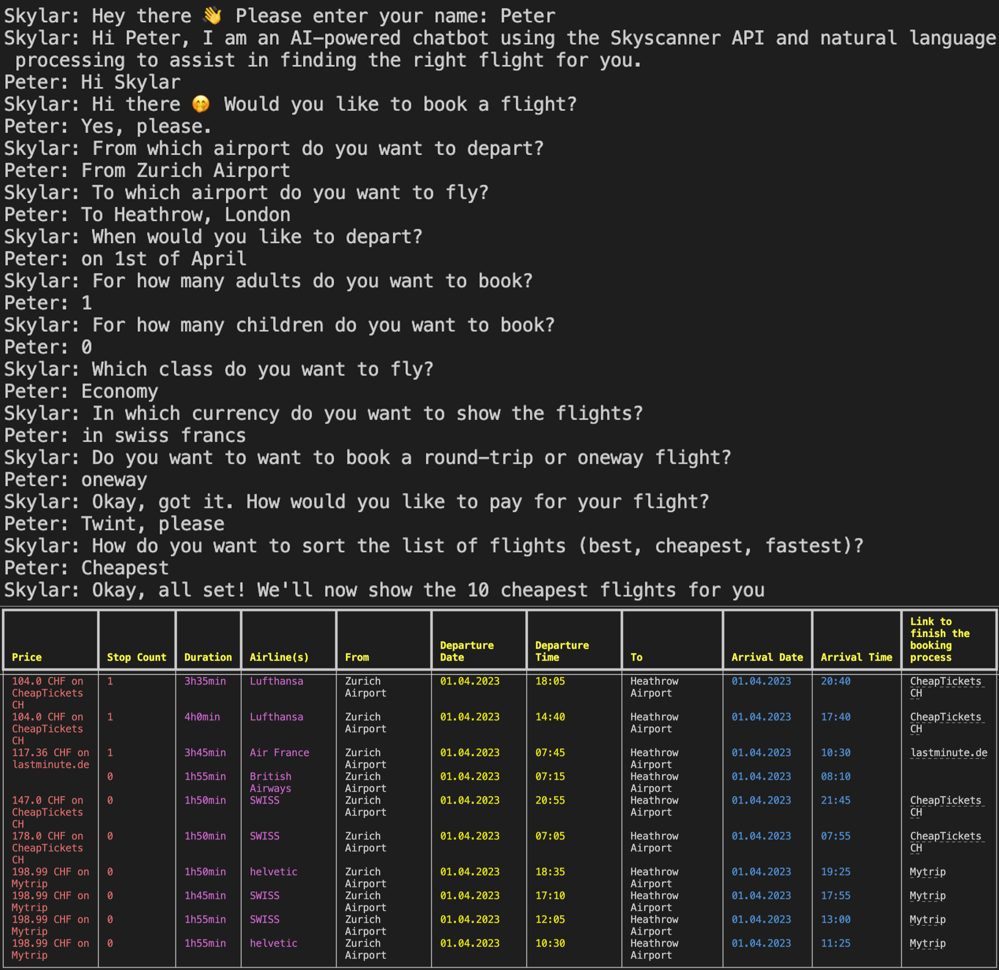
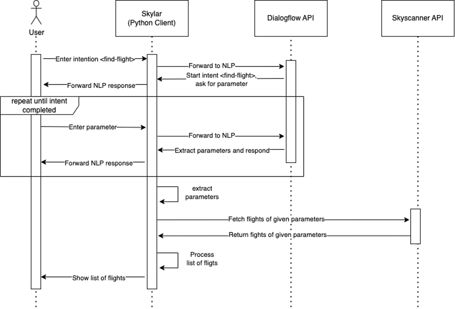
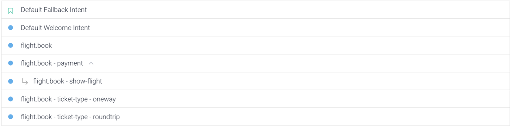
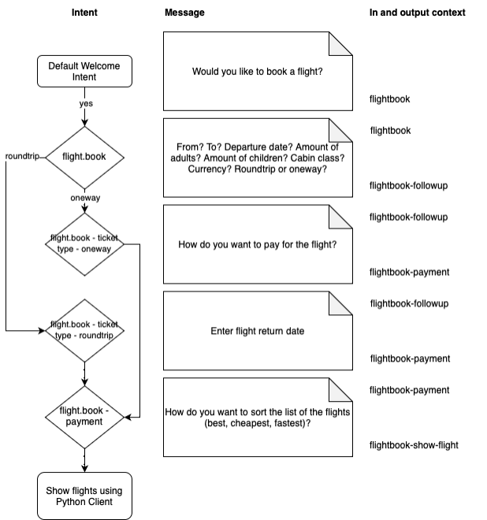
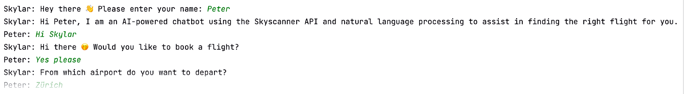
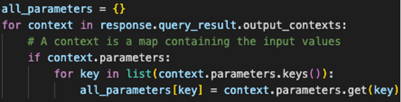

# Skylar Documentation

"Hi! I am an AI-powered chatbot using the Skyscanner API and natural language processing to assist in finding the right flight for you."

This project was developed as part of the AI Foundations course, taught by Dr. Marco Lehmann, during the fall semester of 2022, at the University of Applied Sciences of Eastern Switzerland, department of computer science.

The project duration lasted from Monday, October 3rd, 2022, to Sunday, November 6th, 2022.

Skylar was created with ❤️ and passion by Patrick Wissiak and Thomas Rüegg.

## Table of Contents

- [Introduction](#introduction)
  - [Functionality](#functionality)
  - [Conversation Snippet](#conversation-snippet)
- [Documentation](#documentation)
  - [Project Overview](#project-overview)
  - [Dialogflow Agent](#dialogflow-agent)
    - [Intents](#intents)
    - [Entities](#entities)
  - [Python Client](#python-client)
    - [Preprocess Parameters](#preprocess-parameters)
    - [Extracting Parameters from the NLP Response](#extracting-parameters-from-the-nlp-response)
  - [Skyscanner API](#skyscanner-api)
- [Discussion](#discussion)
  - [Dialogflow](#dialogflow)
  - [Closing Remarks](#closing-remarks)

## Introduction

Finding a flight can be devastating, especially considering the many options and websites of airlines that are currently out there. We wanted to create a bot helping out of that mess that shows the best flights.

We set ourselves the goal of creating an excellent bot. It should be helpful, fun to use and certainly filter the essential details out of the broadness of natural language, and do something cool with that.

Since the bot is helping its user find flight information and is also utilizing the Skyscanner API, we named it ✨Skylar✨.

### Functionality

Skylar will ask you about all details needed, such as where you want to fly to, what your departure airport is, how many adults you wish to book the flight for etc. Then, it will present the ten most suitable flights for you, including their actual prices. On top of that, the user can choose between three different sorting options (best, cheapest, fastest) to get a better overview of the found flights. After choosing a flight, there's a deeplink the user may open to actually finish the booking and pay for the flight.

But why should anyone even bother using Skylar instead of using skyscanner.com directly? Websites (like skyscanner.com) are typically filled with ads and distracting content. Skylar just wants to help you with your flight, cuts out all the clutter and helps guide you through the process.

We envision being able to talk to Skylar to in the future to fully realize its potential and usability since talking is more convenient than typing.

### Conversation Snippet

Here is what a conversation with Skylar might look like:



## Documentation

### Project Overview

Skylar is made of three parts. The Python client is the frontend, which communicates with Dialogflow and Skyscanner in the backend. Users will not notice any of the backend parts involved, but will only interact with Skylar through their terminal. The following diagram explains the procedure visually.



The user interacts with the Python client through a terminal. The input of the user is typically forwarded to Dialogflow to figure out its intent. Dialogflow's answer is then prompted to the user in the terminal of the Python client. Eventually, Skylar's Dialogflow part gathered all the info needed in order to perform a Skyscanner API call. The Python client’s main task is to preprocess and orchestrate the data between the end user and the Skyscanner API.

We will cover each part in greater detail in the following chapters.

### Dialogflow Agent

#### Intents



The preceding figure shows the intents configured to book a flight with Skylar on Dialogflow. The screenshot does not represent the structure of the intents well.

To find out more about how the intents work together, the following flowchart clarifies the intent structure as well as the purpose of each intent, including their in and output contexts.



During intent `flight.book`, Skylar will figure out most of the information needed to find suitable flights. Later on, other intents figure out additional information. These extra intents are required since we thought Skylar should understand the difference between a one-way and a round-trip flight. This way, if the user asks for a round-trip ticket, Skylar will also ask for a return date.

#### Entities

Dialogflow offers parameters that automatically get interpreted using natural language processing and mapped to a specific format. A date, for example, automatically gets mapped to the corresponding ISO date format. This makes parsing and handling of parameters much easier and enables text inputs like “tomorrow” to be handled correctly by the Python client, who would not know how to interpret such a value. Skylar uses built-in entities from Dialogflow to handle the following types:

- Numbers `@sys.number`
- Dates `@sys.date-time`
- IATA codes of airports `@sys.airport`
- Currencies `@sys.currency-name`

The only entity that does not provide the needed format for the Skyscanner API is the parameter for the preferred cabin class. Fortunately, Dialogflow offers a very neat way to configure custom parameters through entities. The following figure shows how this custom parameter is configured for Skylar.


### Python Client

When first starting `client.py`, the Python client will ask for the user's name. Knowing the user's name is not functional but purely for cosmetic reasons. To better understand who said what during the conversation, the name of the message's author is displayed on the front of each message.



Behind the scenes the Python client connects to the Dialogflow API and forwards the messages between the natural language processing (NLP) and the user. This way, the user does not know that he is actually talking to an NLP, and a natural conversation flow is guaranteed. The part of the Python client that handles the forwarding of messages continues until the context "flight.book - show-flight" is active, which indicates that the Python client should fetch the flights from the Skyscanner API and show the result to the user. The user may then choose a flight and proceed to open the displayed hyperlink to get redirected to the booking agency to actually finish the booking process.

#### Preprocess Parameters

The built-in entities of Dialogflow combined with the possibility to add custom entities make preprocessing by the Python client mostly obsolete. The only task for the Python client is to extract the right parameters and map them to the corresponding parameters of the request to the Skyscanner API.


#### Extracting Parameters from the NLP Response

All parameters are saved inside of a context. In order to get all parameters at once, the Python client iterates over all contexts and extracts their parameters.



### Skyscanner API

The Skyscanner API is a powerful interface that provides many endpoints to fetch data concerning flights. Unfortunately, its usage is not always straightforward, and the documentation sometimes lacks in detail. Nevertheless, it is a worthy data provider for Skylar.

A simple request payload, which the Python client could dispatch, is displayed in the figure on the right. The API returns approximately 2000 lines of JSON data, containing flights, prices, agencies, carriers (a.k.a. airlines), deep links to the agent’s website, sorting options, statistics, and so on.

```json
{ 
    "query": {
        "market": "CH",
        "locale": "de-DE",
        "currency": "CHF",
        "queryLegs": [
            {
                "date": {
                    "day": 1,
                    "month": 4,
                    "year": 2023
                },
                "originPlaceId": {
                    "iata": "ZRH"
                },
                "destinationPlaceId": {
                    "iata": "LAX"
                }
            }
        ],
        "adults": 1,
        "cabinClass": "CABIN_CLASS_ECONOMY"
    }
}
```

## Discussion

### Dialogflow

Google's Dialogflow is a good fit for this project since it's well-documented, there are lots of tutorials, and it is relatively mature.

We have learned that in Dialogflow, newly learned parameters are to be found under "Action and Parameters". Contexts are used to structure the intent sequence and to pass the newly learned parameters from one intent to the next.

We had to learn the hard way that changing the context parameters will mess up the visual representation of the intent structure. Re-entering the previous context parameters won't bring the visualization back, follow up intents will only be displayed as regular intents from that point on, even though its structure logic remains the same. This has been a bit unlucky for our fancy screenshot for this documentation.

This was when we first noticed the flaws of the tool. Google's Dialogflow seems to be struggling to understand nuances and sometimes likes to fall back to its default intent quickly. We eventually figured out why and were able to minimize the occurrence, though we would wish for Dialogflow to be a bit smarter than that.

With that being said, realizing a project like this would have been impossible by only having the Python client, which made us once again realize the value of a tool like Dialogflow and AI in general.

## Closing Remarks

Contrary to the first belief, the possibilities of AI in the form we are using it (Google Cloud Dialogflow) are still relatively limited. Making sure all the components work well together poses another set of new challenges and limitations since in our case we are basically limited to what data Skyscanner wants to hear. This of course was preset by the architecture we chose to use.

Nevertheless, chatbots, in general, have great potential because they can filter intent out of natural language, which is undoubtedly helpful and saves lots of manual clicking and navigating of an application or a terminal. We see natural language processing as most valuable when actually speaking to a bot instead of typing (e.g. Google Assistant, Siri).

It has been exciting for us to play around in Google's Cloud Platform. Looking back, we definitely learned a lot, and we are happy with the result of our work, even though we ended up spending more time than we had initially anticipated.
